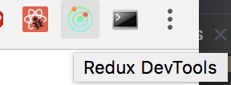
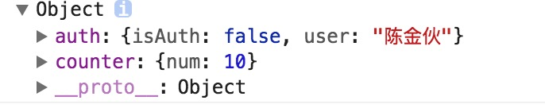
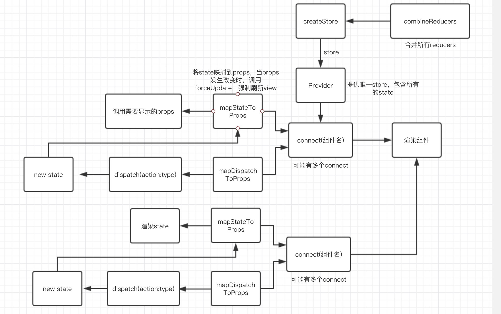

[上一篇](https://github.com/TypeInfos/redux-demo02)是用手动管理redux的方式来渲染页面，着实有点累人，今天用react-redux提供的Provider和connect两个接口来链接

redux中store变化时，（subscribe）订阅的函数就被调用一次，现在我们要忘记subscribe，记住reducer，action和dispatch就好了。

#### 下载&&启动

<pre>
cd 新文件夹
git clone git@github.com:TypeInfos/redux-demo03.git
cd redux-demo03/my-app
npm install =>安装package.json中的依赖
npm start => 运行
</pre>

###### 如果你的谷歌浏览器没有装redux插件


把src目录下的index.js

```
const store = createStore(allReducers,
    compose(applyMiddleware(thunk),
        window.devToolsExtension?window.devToolsExtension():()=>{}
    ));
```

改成：

```
const store = createStore(allReducers,
    compose(applyMiddleware(thunk)
    ));
```

我们用手动管理redux时传入store也是只传一次，所以Provider在应用最外层，并且也只传一次store，因为store在redux有且只有一个，这是Provider的唯一作用。

这里重点介绍connect：


Connect负责从外部获取组建需要的参数，

```
export default function connect(
mapStateToProps, mapDispatchToProps, 
mergeProps, options = {}) {}
```

###### mapStateToProps
从字面上理解就是映射从state到props，传入所有state，返回指定的state数据。
这里可以来对比下[上一篇](https://github.com/TypeInfos/redux-demo02)手动管理和今天的connect的差别在哪：

```
import React from 'react';

export default class Gun extends React.Component{
    render(){
        const store = this.props.store;
        return(
            <div>
                <h1>当前有机枪${store.getState()}把</h1>
                <button onClick={()=>{store.dispatch(this.props.addGun())}}>ADD</button>
                <button onClick={()=>{store.dispatch(this.props.removeGun())}}>REMOVE</button>
            </div>
        )
    }
}
```
上面获取机枪是通过store.getState()来获取，而store又是通过父组件传递下来，相当于要获取状态得这样：

```
this.props.store.getState().属性名
```
而且父级还得传入createStore创建出来的store，一旦属性多了就很难管理，这就是mapStateToProps存在的意义，mapStateToProps执行后应该返回一个对象，里面的每一个键值对就是一个__映射__，在react-redux中我们可以这样写：

```
class Gun extends React.Component{

    render(){
        const num = this.props.num
        return(
            <div>
                <h1>当前有机枪{num}把</h1>
            </div>
        )
    }
}
const mapStateToProps = (state) =>{
    return {num:state.counter.num}
}
```
通过这个函数来将state的属性映射到当前组建的props上，mapStateToProps会订阅 Store，每当state更新的时候，就会自动执行，重新计算 UI 组件的参数，从而触发 UI 组件的重新渲染。

```
function mapStateToProps(state) {
      return { todos: state.todos }
    }
在组件里面就可以使用this.props.todos来获取state.todos
```

###### mapDispatchToProps
从字面上理解就是将dispatch映射到props，也就是将[上一篇](https://github.com/TypeInfos/redux-demo02)我们手动dispatch的函数映射到当前组件props来使用，那岂不乐哉，不用再一次一次的从父组件传递到子组件，先看上一次的例子代码：

```
import React from 'react';
import Gun from './Gun'

export default class Show extends React.Component{
    render(){
        return(
        //由于要保持组件的低耦合，这里我们用的是父组件传入的props
            <Gun store={this.props.store}
            addGun={this.props.addGun} 
            removeGun={this.props.removeGun} />
        )
    }
}

import Show from './gun/index';
import {createStore} from 'redux';
import {counter} from './gun/Gun.reducer'
import { addGUN, removeGUN } from './gun/Gun.reducer';

const store = createStore(counter,10);

store.subscribe(render);

render();
function render() {
//给子组件传入props
    ReactDOM.render(<Show store={store} addGun={addGUN} removeGun={removeGUN} />, 
        document.getElementById('root'));
}

```
现在可以用mapDispatchToProps简单实现上面的功能：

```
import React from 'react';
import {connect} from 'react-redux';
import {addGUN,addGunAsync,removeGUN} from './Gun.reducer'


class Gun extends React.Component{

    componentDidMount(){
        console.log(this.props.num)
    }

    render(){
        const num = this.props.num
        const addGun = this.props.addGUN
        const removeGun = this.props.removeGUN
        const addGunAsync = this.props.addGunAsync
        return(
            <div>
                <h1>当前有机枪{num}把</h1>
                <button onClick={addGun}>ADD</button>
                <button onClick={removeGun}>REMOVE</button>
                <button onClick={addGunAsync}>ADD_ASYNC</button>
            </div>
        )
    }
}
const mapStateToProps = (state) =>{
    return {num:state.counter.num}
}
//将这三个函数映射成props，供自己调用
const actionCreators = { addGUN, removeGUN,addGunAsync };
export default connect(mapStateToProps, actionCreators)(Gun)
```
还记得[上一篇](https://github.com/TypeInfos/redux-demo02)手动dipatch：

```
store.dispatch(this.props.addGun())
```
这里的mapDispatchToProps都已经帮我们做好了，我们只需调用它就可以。
mapDispatchToProps是connect函数的第二个参数，用来建立 UI 组件的参数到store.dispatch方法的映射。也就是说，它定义了哪些用户的操作应该当作 Action，传给 Store。它可以是一个函数，也可以是一个对象。

如果mapDispatchToProps是一个函数，会得到dispatch和ownProps（容器组件的props对象）两个参数。

第三和第四个参数暂时可以不用看。

#### 总结connect：
* mapStateToProps，mapDispatchToProps，最终会经过selectorFactory，与React组件本身的props进行合并。
* mapStateToProps注册了subscribe，这样每次dispatch时，回调完reducer后，就会调用mapStateToProps，将新的state传递过来。此时再将state合并到组件的props上，会引起props的改变，从而触发一次forceUpdate（强制更新），从而自动刷新view
* mapDispatchToProps将方法映射成props，mapStateToProps是将state映射成props
* connect方法对React组件进行了包装，返回一个容器型组件


###### combineReducers(reducers)
随着应用变得复杂，reducer可以能会有好几个，但是redux只有一个store，createStore(reducers,...);这时候就需要一个函数来结合所有reducer，
比如有一个counter

```
//两个reducer
function counter(state={num:10}, action){
    switch(action.type){
        case ADD_GUN:
            return {num:state.num+1}
        case REMOVE_GUN:
            return {num:state.num-1}
        default:
            return {...state};
    }
}

function auth(state={isAuth:false,user:'陈金伙'},action) {
    switch (action.type){
        case LOGIN:
            return {...state, isAuth:true};
        case LOGOUT:
            return {...state, isAuth:false};
        default:
            return state;
    }
}
```
用redux自带的combineReducers来结合它们两个

```
//combineReducers.js
export default combineReducers({
    counter,auth
})
```
导出combineReducers.js并传入createStore()。这时redux自动将两个reducer结合成一个reducer，本来应该有两个store的，现在就变成一个，可以打印下当前的store.getState();

会发现它现在是一个对象，里面包括两个state，所以相对应的connect里面的mapStateToProps就要这样写：

```
const mapStateToProps = (state) =>{
    return {
    //一定要写state.auth，没写的话找不到isAuth
        isAuth:state.auth.isAuth,
        user:state.auth.user
    }
}
```
总结：
------------
这是我现在对react-redux的理解：


对比下[上一篇](https://github.com/TypeInfos/redux-demo02)手动管理redux的总结图：


